# Azure Zero Trust Architecture
A hands-on Azure project demonstrating a Zero-Trust architecture, using a secure-by-default Hub-Spoke network with 0 public IPs, secured by Private Endpoints &amp; Managed Identity.

A hands-on Azure project demonstrating a Zero-Trust architecture, using a secure-by-default Hub-Spoke network with 0 public IPs, secured by Private Endpoints & Managed Identity.

This repository documents the step-by-step build of a foundational, secure enterprise environment in Microsoft Azure. The architecture is built on a "Zero-Trust" / "Secure-by-Default" model, where no component is exposed to the public internet.

---

## Final Result

The diagram above represents the final architecture, with all resources being 100% private, and no public IP addresses. Access is secured by Private Endpoints and network segmentation.

---

## Features

This project demonstrates the **prevention**-first layer of a cloud security posture.

* **Deploy (Network):** Builds a secure **Hub-Spoke** network, the gold standard for enterprise-scale and isolation.
* **Isolate (Compute):** Deploys a web server VM with **zero public IP addresses**, making it completely invisible to the public internet.
* **Secure (Database):** Deploys an Azure SQL Database that is fully locked down from the internet using a **Private Endpoint** placed in a dedicated `db-subnet`.
* **Secure (Secrets):** Deploys an Azure Key Vault that is *also* fully locked down using a **Private Endpoint** in a dedicated `pe-subnet`.
* **Secure (Identity):** Configures the Key Vault to use modern **Azure RBAC** for permissions instead of legacy access policies.
* **Automate (Identity):** Uses a **System-Assigned Managed Identity** for the VM, granting it the *least-privilege* role (`Key Vault Secrets User`) to read the database password. This completely eliminates passwords or secrets from code.
* **Cost-Optimize:** Implements cost-saving measures, including a `B1s` VM with **auto-shutdown** and a **Serverless** SQL database with **auto-pause**.

---

### Network & Application Flow
1.  The `hub-vnet` (10.10.0.0/16) is the central security hub, peered with the `spoke-prod-vnet`.
2.  The `spoke-prod-vnet` (10.20.0.0/16) holds the application, which is segmented into three subnets:
    * `web-subnet`: Contains the `web-vm-01`.
    * `db-subnet`: Contains the Private Endpoint for the SQL Database.
    * `pe-subnet`: Contains the Private Endpoint for the Key Vault.

### Identity & Data Flow
1.  The `web-vm-01` (in `web-subnet`) needs the database password.
2.  Its **Managed Identity** makes a call to the **Azure Key Vault** via the private endpoint in the `pe-subnet`.
3.  **Azure RBAC** confirms the VM has the `Key Vault Secrets User` role and returns the password.
4.  The `web-vm-01` then uses this password to connect to the **Azure SQL Database** via the private endpoint in the `db-subnet`.

---

## Prerequisites

* An **Azure Subscription**. The Free Tier is sufficient; all services used here are designed to work with the initial $200 credit.
* Basic familiarity with navigating the Azure Portal.

---

# Zero-Trust Fortress: Full Tutorial (Project 1)

This project builds the core infrastructure, including the networks, a web server, a database, and a secure "safe" for our secrets (Key Vault).

---

## Step 1: Create the Resource Group

This is the main project folder that will hold all our resources.

1.  Log in to your Azure Portal.
2.  In the main search bar at the top, type: **Resource groups** and select it.
3.  Click the **+ Create** button.
4.  On the "Create a resource group" page, fill in the following:
    * **Subscription:** Select your "Azure free account".
    * **Resource group:** `core-security-rg`
    * **Region:** `East US 2` (or your preferred region)
5.  Click **Review + create**, then click **Create**.

---

## Step 2: Create the Hub Virtual Network (hub-vnet)

This is our central "mall" for security services.

1.  In the Azure Portal search bar, type: **Virtual network** and select it.
2.  Click the **+ Create** button.
3.  On the **Basics** tab:
    * **Resource group:** Select `core-security-rg`.
    * **Name:** `hub-vnet`
    * **Region:** `East US 2` (must be the same as your RG)
4.  Click **Next: Security**.
5.  On the **Security** tab:
    * We will leave all options (Azure Bastion, DDoS Protection, Azure Firewall) as **`Disable`**. We will build these manually later.
6.  Click **Next: IP Addresses**.
7.  On the **IP Addresses** tab:
    * **IPv4 address space:** Delete the default and type: **`10.10.0.0/16`**
    * **Subnets:** We will edit the `default` subnet and add a new one.
    * Click on the word **`default`** to edit it.
    * **Edit Subnet (Firewall):**
        * **Subnet purpose:** Select **`Azure Firewall`**.
        * **Name:** It will auto-fill to `AzureFirewallSubnet`.
        * **Starting address:** Type **`10.10.1.0`**
        * **Size:** It will default to `/26`. **Leave this as it is.**
        * Click **Save**.
    * Now, click the **+ Add subnet** button.
    * **Add Subnet (Bastion):**
        * **Subnet purpose:** Select **`Azure Bastion`**.
        * **Name:** It will auto-fill to `AzureBastionSubnet`.
        * **Starting address:** Type **`10.10.2.0`**
        * **Size:** Select the smallest allowed size, **`/26`**.
        * Click **Add**.
8.  Click **Next: Tags**.
9.  On the **Tags** tab, leave it blank and click **Next: Review + create**.
10. Wait for "Validation passed," then click **Create**.

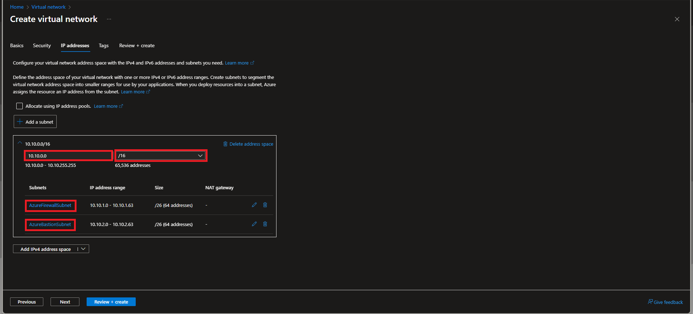

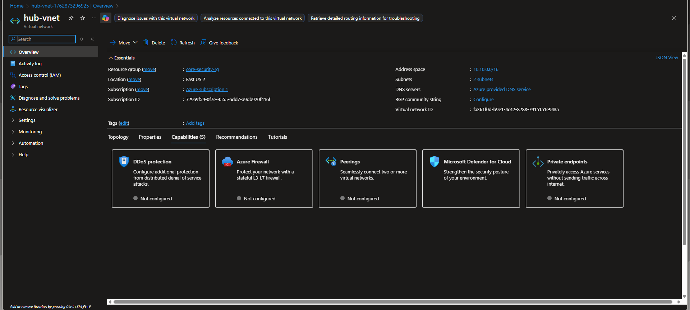

---

## Step 3: Create the Spoke Virtual Network (spoke-prod-vnet)

This is the isolated "restaurant" for the application.

1.  Go back to the **Virtual network** service and click **+ Create** again.
2.  On the **Basics** tab:
    * **Resource group:** Select `core-security-rg`.
    * **Name:** `spoke-prod-vnet`
    * **Region:** `East US 2`
3.  Click **Next: Security**.
4.  On the **Security** tab, leave all options **`Disable`**.
5.  Click **Next: IP Addresses**.
6.  On the **IP Addresses** tab:
    * **IPv4 address space:** Delete the default and type: **`10.20.0.0/16`**
    * **Subnets:** We will add three custom subnets.
    * Click on the word **`default`** to edit it.
    * **Edit Subnet (web-subnet):**
        * **Subnet purpose:** Leave as **`Default`**.
        * **Name:** Type **`web-subnet`**
        * **Starting address:** Type **`10.20.1.0`**
        * **Size:** Type **`/24`**
        * Click **Save**.
    * Click the **+ Add subnet** button.
    * **Add Subnet (db-subnet):**
        * **Subnet purpose:** Leave as **`Default`**.
        * **Name:** Type **`db-subnet`**
        * **Starting address:** Type **`10.20.2.0`**
        * **Size:** Type **`/24`**
        * Click **Add**.
    * Click the **+ Add subnet** button again.
    * **Add Subnet (pe-subnet):**
        * **Subnet purpose:** Leave as **`Default`**.
        * **Name:** Type **`pe-subnet`** (This is for the Private Endpoints)
        * **Starting address:** Type **`10.20.3.0`**
        * **Size:** Type **`/24`**
        * Click **Add**.
7.  Click **Next: Tags**.
8.  On the **Tags** tab, leave it blank and click **Next: Review + create**.
9.  Wait for "Validation passed," then click **Create**.

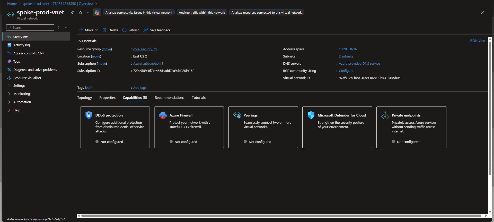

---

## Step 4: VNet Peering (Connecting the Networks)

Let's build the "hallway" between the hub and spoke.

1.  In the Azure search bar, go to your **`hub-vnet`** resource.
2.  On the left-hand menu, under "Settings," click on **Peerings**.
3.  Click the **+ Add** button.
4.  Fill out the form:
    * **Top Section (Remote VNet):**
        * **Peering link name:** `spoke-to-hub-peering`
        * **Virtual network:** Select `spoke-prod-vnet`.
        * Leave all checkboxes as default.
    * **Bottom Section (Local VNet):**
        * **Peering link name:** `hub-to-spoke-peering`
        * Leave all checkboxes as default.
5.  Click the blue **Add** button.
6.  Wait 1-2 minutes for the **Peering state** to change from "Updating" to **"Connected"**.

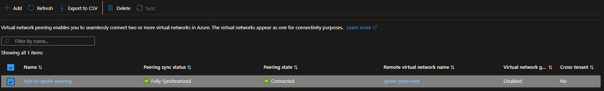

---

## Step 5: Create the Web Server VM (web-vm-01)

Now we build the "waiter" for our application, placing it in the `web-subnet`.

1.  In the Azure search bar, type: **Virtual machines** and select it.
2.  Click **+ Create** -> **Azure virtual machine**.
3.  On the **Basics** tab:
    * **Resource group:** `Core-Security-RG`
    * **Virtual machine name:** `web-vm-01`
    * **Region:** `East US 2`
    * **Security type:** `Standard`
    * **Image:** `Ubuntu Server 22.04 LTS - x64 Gen2`
    * **Size:** `B1s` (Click "See all sizes" to find this low-cost option)
    * **Administrator account:**
        * **Authentication type:** `Password`
        * **Username:** `azureuser` (or your choice)
        * **Password:** Create and **write down** a strong password.
    * **Inbound port rules:**
        * **Public inbound ports:** Select **`None`**. (This is critical for security!)
4.  Click **Next: Disks**.
5.  On the **Disks** tab:
    * **OS disk type:** Change from "Premium SSD" to **`Standard SSD (lrs)`** to save costs.
    * Check the box for **`Delete with VM`**.
6.  Click **Next: Networking**.
7.  On the **Networking** tab (This is the most important part):
    * **Virtual network:** Select `spoke-prod-vnet`.
    * **Subnet:** Select `web-subnet (10.20.1.0/24)`.
    * **Public IP:** Ensure this is set to **`None`**.
    * **NIC network security group:** `Basic`
    * Check the box for **`Delete network interface with VM`**.
8.  Click **Next: Management**.
9.  On the **Management** tab:
    * Check the box for **`Enable auto-shutdown`**.
    * Set a **Time** (e.g., `19:00`) and your **Time zone** (e.g., `(UTC+01:00) West Central Africa`).
    * Leave "Enable system assigned managed identity" **unchecked** (we'll do this later).
10. Click **Next: Monitoring**.
11. On the **Monitoring** tab:
    * Set **Boot diagnostics** to **`Disable`** (to save a small cost).
12. Click **Next: Advanced**, then **Next: Tags**.
13. On the **Tags** tab, leave it blank and click **Next: Review + create**.
14. Wait for "Validation passed," then click **Create**.

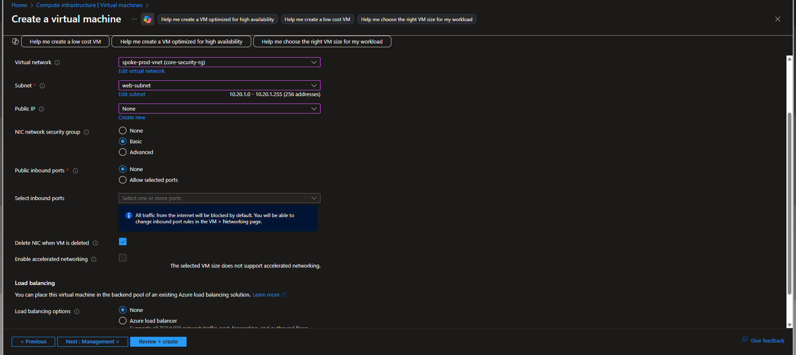

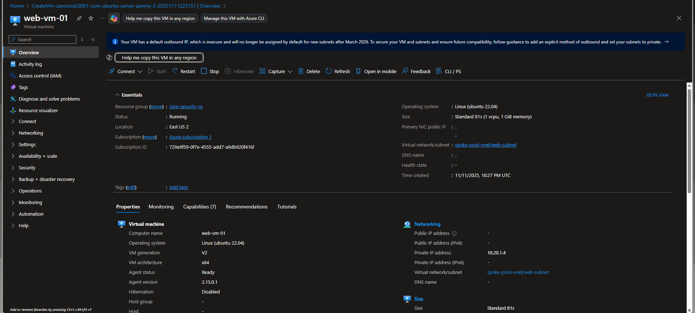

---

## Step 6: Create the SQL Database (web-db-01)

Now we build the secure "chef" for our application, locking it in the `db-subnet`.

1.  In the Azure search bar, type: **Azure SQL** and select it.
2.  On the left-hand menu, click **"Azure SQL Database"**.
3.  Click the **+ Create** button.
4.  On the **Basics** tab:
    * **Resource group:** `core-security-rg`
    * **Database name:** `web-db-01`
    * **Server:** Click the **"Create new"** link.
        * A new panel will open.
        * **Server name:** `core-security-server` (or another unique name)
        * **Location:** `East US 2`
        * **Authentication method:** `Use SQL authentication`
        * **Server admin login:** `sqladmin`
        * **Password:** Create and **write down** a strong password. This is your database password.
        * Click **OK**.
    * Back on the "Basics" tab, click **"Configure database"** (under Compute + storage).
        * Select **`Serverless`**.
        * Set **Max vCores** to `1` and **Min vCores** to `0.5`.
        * Set **Data max size** to `1` GB.
        * Set **Auto-pause delay** to **`1 hour`**.
        * Click **Apply**.
    * **Zone redundancy:** Select **`No`**.
5.  Click **Next: Networking**.
6.  On the **Networking** tab:
    * **Connectivity method:** Select **`Private endpoint`**. (This is critical!)
    * **Private endpoints:** Click **"+ Add private endpoint"**.
        * A new panel will open.
        * **Name:** `web-db-01-pe`
        * **Virtual network:** `spoke-prod-vnet`
        * **Subnet:** `db-subnet (10.20.2.0/24)`
        * **Integrate with private DNS zone:** `Yes`
        * Click **OK**.
7.  Click **Next: Security**.
8.  On the **Security** tab:
    * Find **Microsoft Defender for SQL** and click **"Start free trial"**.
    * Leave all other settings as default.
9.  Click **Next: Additional settings**.
10. On the **Additional settings** tab:
    * **Use existing data:** Select **`Sample`**. (This will load the `AdventureWorksLT` sample database).
11. Click **Next: Tags**.
12. On the **Tags** tab, leave it blank and click **Next: Review + create**.
13. Wait for "Validation passed," then click **Create**. (This may take 5-10 minutes).

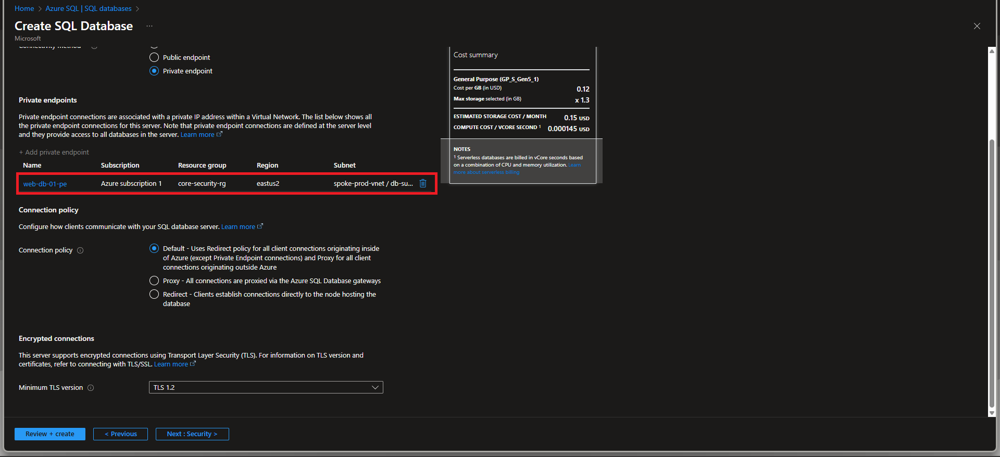

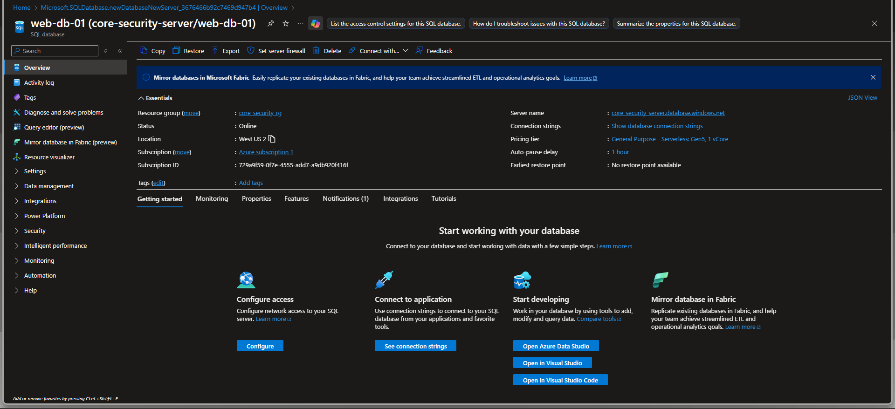

---

## Step 7: Create the Key Vault (core-security-kv)

This is the secure "safe" for the database password.

1.  In the Azure search bar, type: **Key vaults** and select it.
2.  Click the **+ Create** button.
3.  On the **Basics** tab:
    * **Resource group:** `core-security-rg`
    * **Key vault name:** `core-security-kv` (or another unique name)
    * **Region:** `East US 2`
    * **Pricing tier:** `Standard`
    * **Purge protection:** `Disable purge protection`
    * **Days to retain:** `7`
4.  Click **Next: Access configuration**.
5.  On the **Access configuration** tab:
    * **Permission model:** Select **`Azure role-based access control (recommended)`**.
6.  Click **Next: Networking**.
7.  On the **Networking** tab:
    * **Connectivity method:** Select **`Private endpoint`**.
    * **Private endpoints:** Click **"+ Add private endpoint"**.
        * A new panel will open.
        * **Name:** `core-security-kv-pe`
        * **Virtual network:** `spoke-prod-vnet`
        * **Subnet:** `pe-subnet (10.20.3.0/24)` (Our dedicated PE subnet)
        * **Integrate with private DNS zone:** `Yes`
        * Click **OK**.
8.  Click **Next: Tags**.
9.  On the **Tags** tab, leave it blank and click **Next: Review + create**.
10. Wait for "Validation passed," then click **Create**.

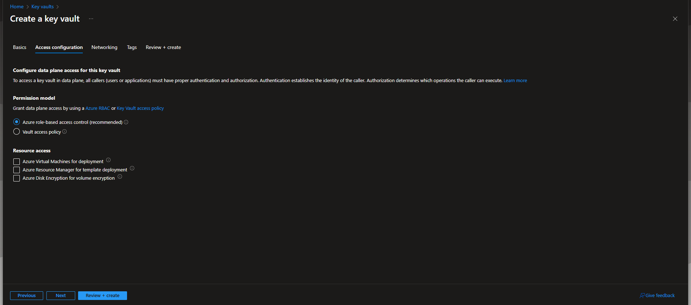

---

## Step 8: The "Lockout" (Fixing Permissions to Add the Secret)

This is where we prove our Zero-Trust model works. We have to fight our own security to add the password.

1.  Go to your new **`core-security-kv`** resource.
2.  On the left menu, click **Secrets**. You will see an error: **"You are unauthorized to view these contents."** This is expected!
3.  **Fix 1 (Identity):** Grant your user account permissions.
    * On the left menu, click **Access control (IAM)**.
    * Click **+ Add** -> **Add role assignment**.
    * **Role:** Search for and select **`Key Vault Secrets Officer`**. Click **Next**.
    * **Members:** Click **+ Select members**. Find and select your own user email (e.g., `johngideon14@gmail.com`). Click **Select**.
    * Click **Next**, then **Review + assign**.
4.  Wait 1-2 minutes for permissions to update.
5.  **Fix 2 (Network):** Grant your IP address temporary access.
    * Go to **Networking** on the left menu.
    * The "Public access" tab will show "No public access."
    * Change this setting to **`Selected networks`**.
    * In the "Firewall" section, find the box to add an IP.
    * In a new browser tab, google **"what is my IP"** and copy your IP address.
    * Paste your IP into the box and add **`/32`** to the end (e.g., `102.89.40.12/32`).
    * Click **Save** at the top.
6.  Wait 1-2 minutes for the firewall to update.

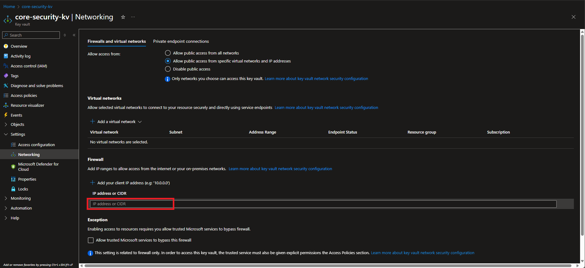

---

## Step 9: Store the Secret (and Close the Hole)

Now we can finally add the password.

1.  Go back to the **Secrets** blade on the left menu. (Refresh your browser if you still see an error).
2.  The error should be gone. Click **+ Generate/Import**.
3.  **Create a secret:**
    * **Name:** `sql-database-password`
    * **Secret value:** Paste the password for your `sqladmin` user (the one you wrote down in Step 6).
4.  Click **Create**.
5.  **CRITICAL:** Go back to the **Networking** blade.
6.  Change the "Public access" setting from "Selected networks" back to **`No public access`**.
7.  Click **Save**. You have now re-secured the vault.

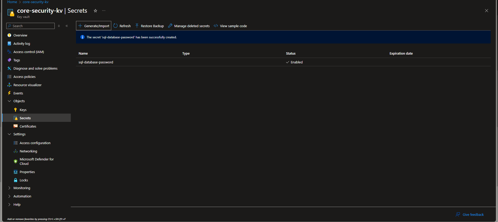

---

## Step 10: Grant the VM Access (Managed Identity)

The final step. We give our VM (`web-vm-01`) permission to *read* the secret.

1.  **Part A: Enable Identity on VM**
    * In the search bar, go to your **`web-vm-01`** resource.
    * On the left menu, click **Identity** (under "Settings").
    * Select the **System assigned** tab.
    * Change the **Status** to **`On`**.
    * Click **Save**, then **Yes**.
2.  **Part B: Assign Role to Key Vault**
    * In the search bar, go to your **`core-security-kv`** resource.
    * On the left menu, click **Access control (IAM)**.
    * Click **+ Add** -> **Add role assignment**.
    * **Role:** Search for and select **`Key Vault Secrets User`**. Click **Next**. (This is a lower-privilege role, perfect for a VM).
    * **Members:**
        * **Assign access to:** Select **`Managed identity`**.
        * **Members:** Click **`+ Select members`**.
        * A new panel opens. **Subscription:** "Azure free account".
        * **Managed identity:** Select **`Virtual machine`**.
        * **Select:** Click `web-vm-01`.
        * Click the **Select** button.
    * Click **Next**, then **Review + assign**.

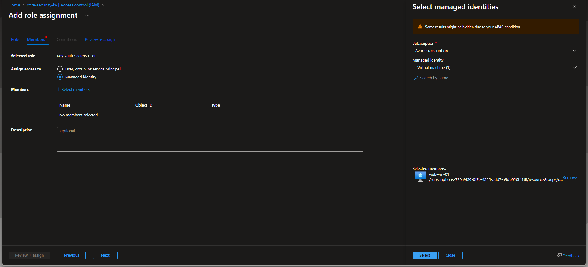

---

### **Project - Complete!**

This foundation is now secure, private, and ready for the next phase.

