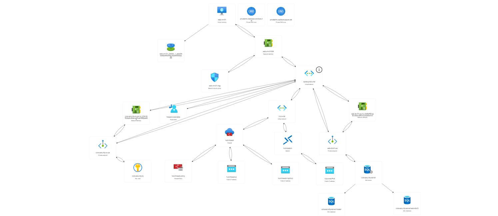
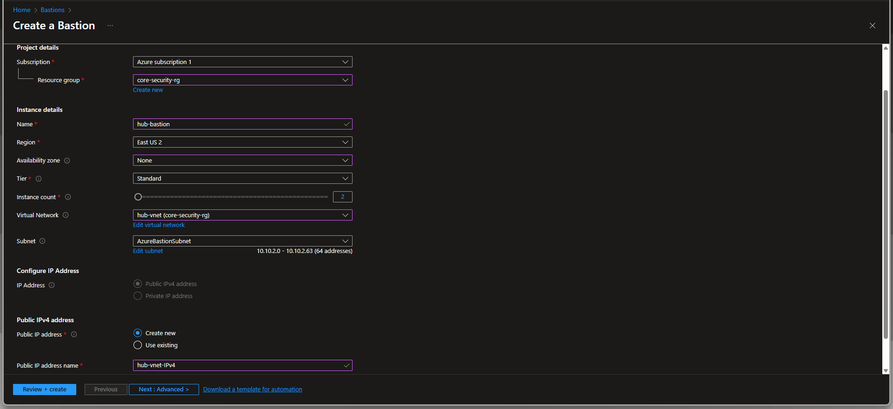
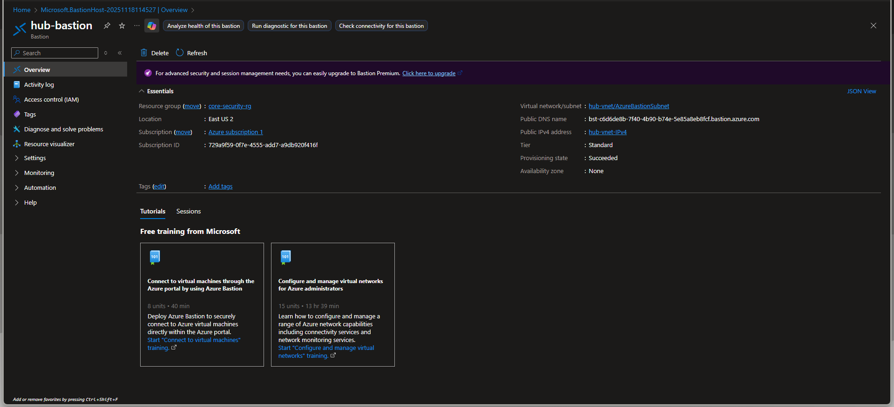
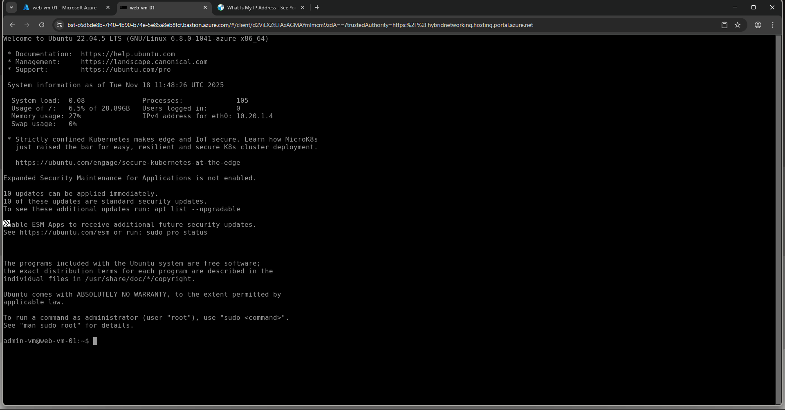
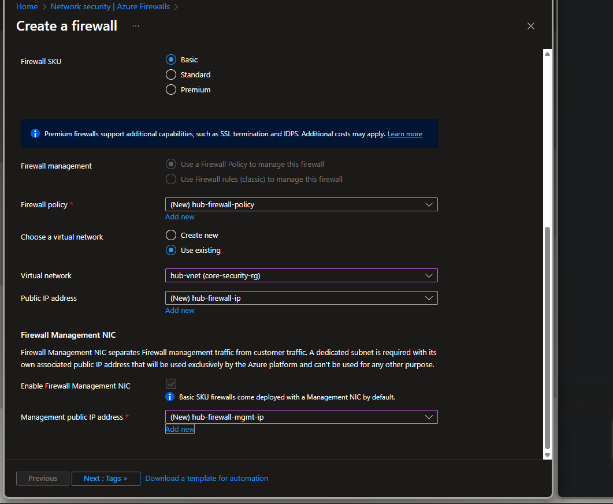
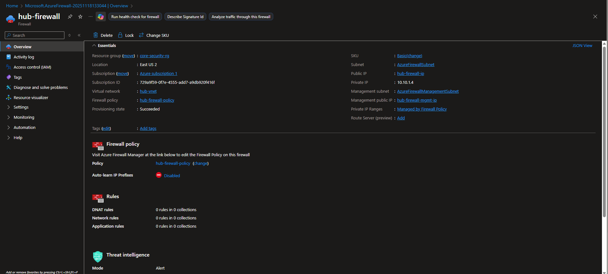
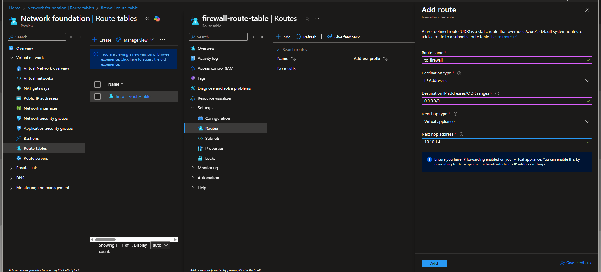
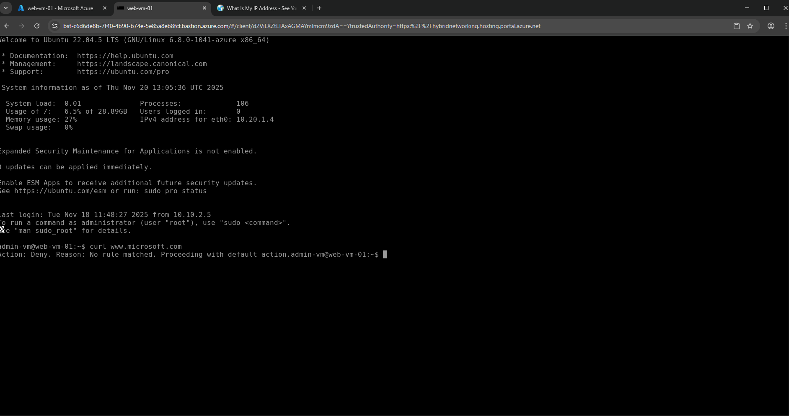

# THE CENTRALIZED FORTRESS

This guide documents the second phase of building the Zero-Trust architecture. The focus is on implementing central security controls to enable secure management access and enforce traffic control (egress filtering).

---

## Final Result 

The completion of this phase moves the network into a fully enforced, managed security state.

                                                             
---
  
## Project Prerequisite

This phase assumes the following foundation is already in place (completed in Project 1):
* **Network:** A secure, peered **Hub-Spoke** network (`hub-vnet` and `spoke-prod-vnet`).
* **Compute:** A private `web-vm-01` deployed into the `web-subnet` with **No Public IP**.
* **Identity:** **Managed Identity** is enabled on the VM, and **Azure RBAC** is configured on the Key Vault.

## Network and Application Flow (The Change)

The primary achievement of Project 2 is the change in how the network routes internet-bound traffic.

* **Old Flow (Project 1 State):** Traffic from the VM went directly to the internet.
    > `[web-vm-01] -->(Direct Internet Egress)--> [World]`
* **New Flow (Project 2 State - Active):** All internet-bound traffic is now forced to the Firewall.
    > `[web-vm-01] --> [Route Table] --> [Azure Firewall] --> [Internet]`
    *(The Firewall inspects the traffic and blocks it unless an explicit rule is set.)*

## Identity and Data Flow (Preservation)

The core Identity flow established in Project 1 remains preserved, ensuring secure access to credentials:

* **VM to Secret:** The `web-vm-01` **Managed Identity** request for the database password is automatically routed securely through the peered VNet to the Key Vault's Private Endpoint.
* **VM to Database:** The application traffic flows from the `web-subnet` to the `db-subnet` (via the VNet Peering), ensuring the private connection to the SQL Database is maintained.

---

## Step 1: Deploy Azure Bastion (Secure Access)

Let's deploy Azure Bastion into the dedicated subnet in the Hub VNet.

1.  In the Azure Portal, search for and create a new **Bastion** resource.
2.  **Tier:** Select **`Basic`** (critical for cost management).
3.  **Availability zones:** Ensure all zones are unchecked (**None**) for easy deployment.
4.  **Virtual network:** Select **`hub-vnet`**.
5.  **Subnet:** It should automatically detects and use **`AzureBastionSubnet`**.
6.  **Public IP address:** Select **`Create new`** (Name: `hub-bastion-ip`).
7.  Click **Review + create**, then **Create**. (Wait few minutes).

   

## Step 2: Test Access via Bastion

let's verify the connection to the private VM using the new secure gateway.

1.  In the Azure Portal, go to your **`web-vm-01`** resource.
2.  Click **Connect** -> **Connect via Bastion**.
3.  Enter the `azureuser` and the password set during VM creation.
4.  A new browser tab should open, showing the command-line terminal.

<ng.

---

## Step 3: Deploy Azure Firewall (Central Checkpoint)

This step deploys the central firewall on the cost-effective Basic SKU, requiring the specific `AzureFirewallManagementSubnet`.

### **Part A: Fix VNet Architecture (Management Subnet)**
* **(Context: Basic Firewall SKU requires two subnets.)**
* Go to **`hub-vnet`** resource -> **Subnets**.
* Click **+ Subnet**.
* **Name:** `AzureFirewallManagementSubnet` (must be exact).
* **Starting address:** `10.10.3.0` (or next available).
* **Size:** `/26` (64 addresses).
* Click **Save**.

### **Part B: Firewall Deployment**
1.  Go to the **Firewalls** service and click **+ Create**.
2.  **Firewall tier:** Select **`Basic`**.
3.  **Firewall management:** Create a new Firewall Policy and name it **`hub-firewall-policy`**.
4.  **Virtual networking:** Select **`hub-vnet`**. (The portal validates the required subnets).
5.  **Public IP address:** Click **Add new** (Name: `hub-firewall-ip`). **(Make sure to NOT reuse the Bastion IP)**.
6.  **Management Public IP address:** This is required for the Basic tier. Click **Add new** (Name: `hub-firewall-mgmt-ip`).
7.  Click **Review + create**, then **Create**.

  

---

## Step 4: Configure Forced Tunneling (Traffic Laws)

This crucial step implements **Forced Tunneling** to ensure the Firewall inspects all traffic leaving the application subnet.

### **Part A: Create the Route Table**
1.  Go to the **Route tables** service and click **+ Create**.
2.  **Resource group:** `Core-Security-RG`.
3.  **Region:** **`East US 2`** (Must match VNet region exactly).
4.  **Name:** `firewall-route-table`.
5.  Click **Review + create**, then **Create**.

### **Part B: Define the Default Route**
1.  Go to the **`firewall-route-table`** resource -> **Routes**.
2.  Click **+ Add**.
3.  **Route name:** `to-firewall`.
4.  **Destination IP addresses/CIDR ranges:** **`0.0.0.0/0`** (The Internet).
5.  **Next hop type:** Select **`Virtual appliance`**.
6.  **Next hop address:** Copy the **"Private IP address"** of your `hub-firewall` resource (e.g., `10.10.1.4`) and paste it here.
7.  Click **Add**.

### **Part C: Associate with the Subnet**
1.  Still in the `firewall-route-table`, click on **Subnets**.
2.  Click **+ Associate**.
3.  **Virtual network:** Select **`spoke-prod-vnet`**.
4.  **Subnet:** Select **`web-subnet`**.
5.  Click **OK**.

  
---

## Step 5: Final Verification

Let's verify that the Forced Tunneling is active by confirming the VM's internet access is denied.

1.  Go back to **`web-vm-01`** resource and connect via **Bastion**.
2.  In the terminal, run the command to test internet connectivity (e.g., `curl www.google.com`).
3.  **Result:** The command will hang or time out. This confirms the **"Default Deny"** state is enforced by the Azure Firewall.

  
---

### Project 2 - Complete!

The Centralized Fortress is built and the gates are locked, and the network is now ready for the next step.

<h3 align="left">Connect with me:</h3>

  
  
   

