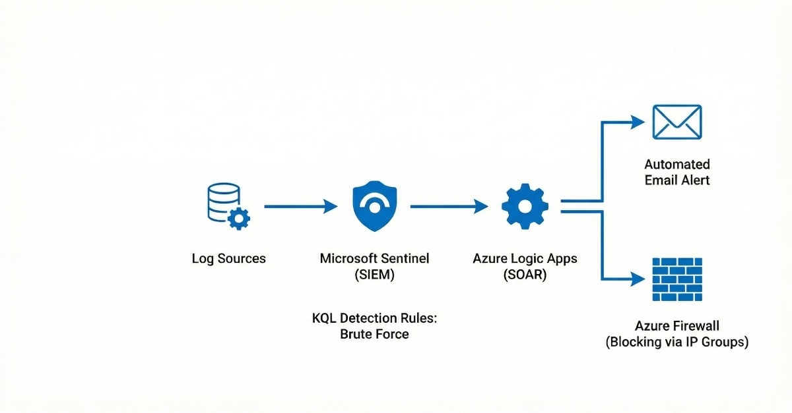
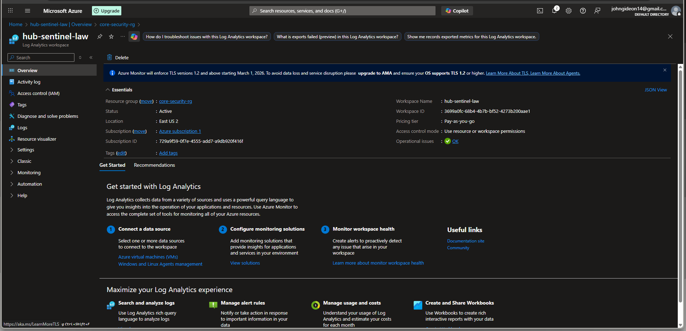
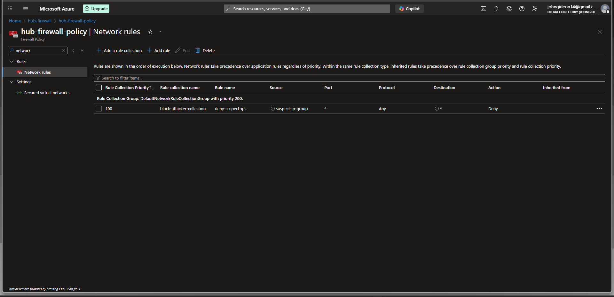
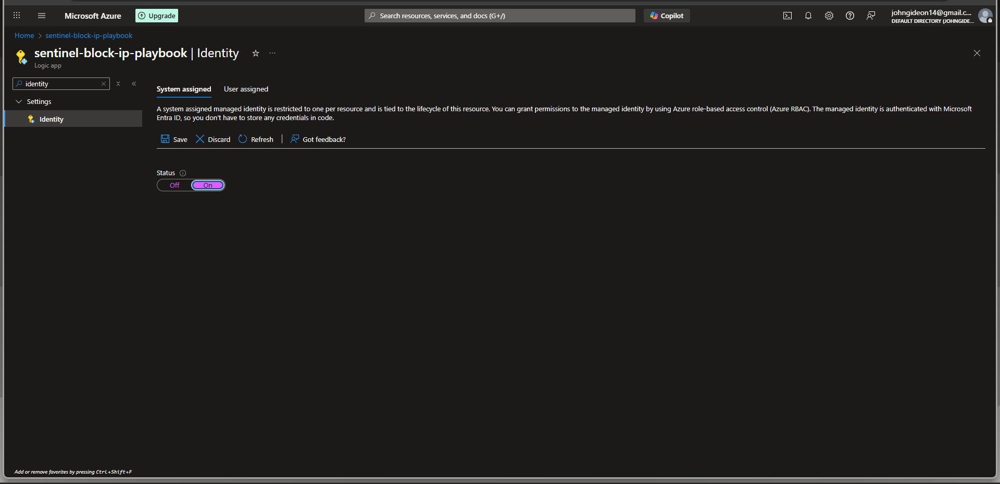
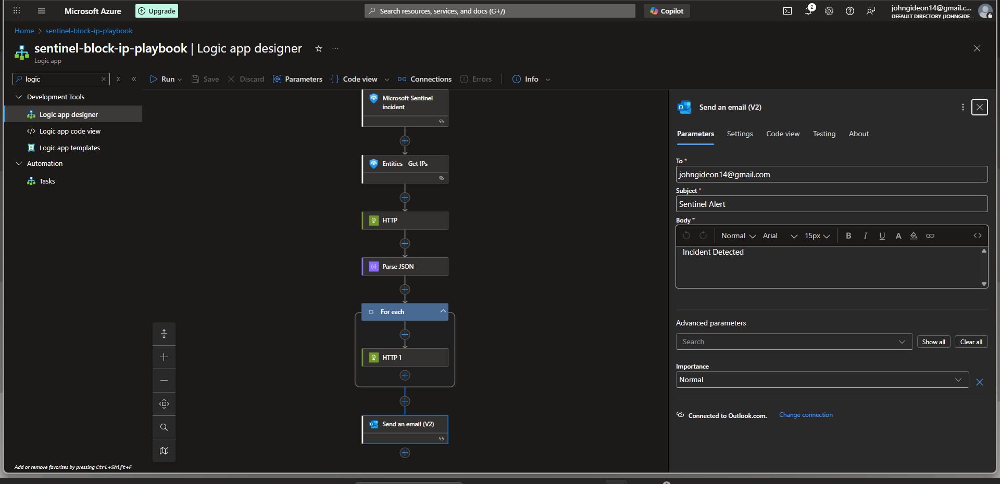
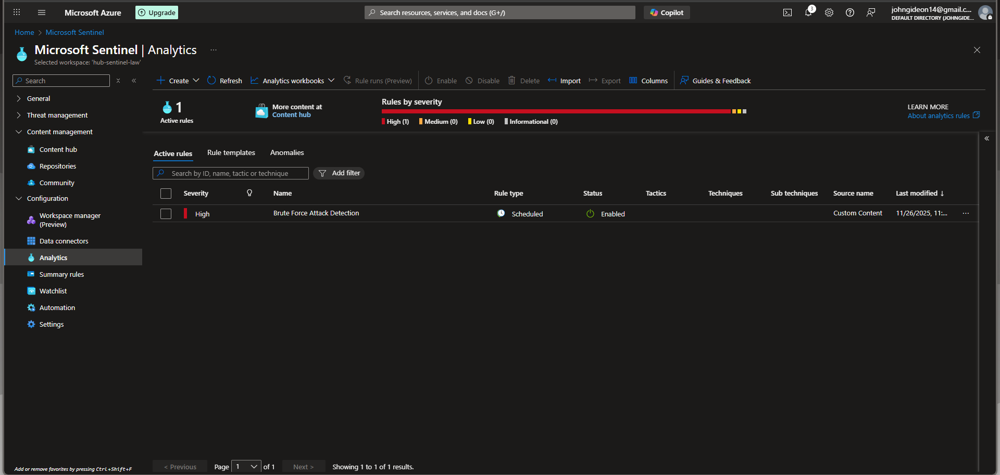
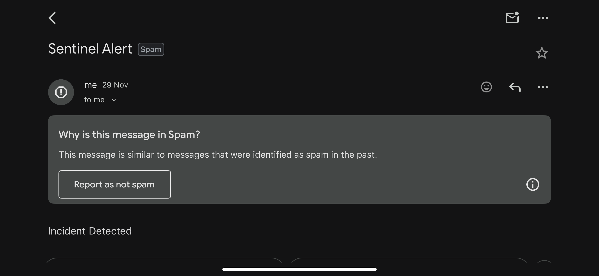

# THE AUTOMATED SOC

This guide provides a step by step details of the final phase: building the "Brain" and "Reflexes" of the fortress. A Mini-SOC (Security Operations Center) is implemented using Microsoft Sentinel to detect threats and  block attackers automatically.

---

## Final Result & Key Features

<p align="left">

**SIEM**: Active log ingestion and correlation using Microsoft Sentinel

**Detection**: Custom KQL rules detecting Brute Force attacks using Sentinel Analytics Rules 

**SOAR (Response)**: Automated email alerting and IP Blocking using Azure Logic Apps 

**Blocking Mechanism**: Dynamic updates to Azure Firewall via **IP Groups** using Azure IP Groups 

---

## Project Prerequisite

This phase builds upon the secured infrastructure from Projects 1 & 2:
* **Infrastructure:** A Hub-Spoke network with a central **Azure Firewall**.
* **Security:** A private VM (`web-vm-01`) monitored by **Microsoft Defender for Cloud**.

---

## Phase 1: Deploy The Intelligence

### Step 1: The Brain (Deploy Microsoft Sentinel)

A central repository for logs and an intelligence engine to analyze them is needed, let's create that.

1.  In the Azure Portal search bar, type **`Microsoft Sentinel`** and select it.
2.  Click **+ Create**.
3.  Click the blue button **"Create a new workspace"**.
4.  **Create Log Analytics Workspace:**
    * **Resource Group:** `core-security-rg`.
    * **Name:** `hub-sentinel-law`.
    * **Region:** `East US 2`.
    * Click **Review + Create**, then **Create**.
5.  **Add Sentinel:**
    * Once the workspace is created, the list will refresh.
    * Select `hub-sentinel-law` and click **Add**.

<p align="left">


### Step 2: The Eyes (Connect Data Sources)

Let's connect the existing security tools to feed data into Sentinel.

1.  **Connect Microsoft Defender for Cloud:**
    * Go to the **Microsoft Sentinel** blade -> **Content management** -> **Content hub**.
    * Search for and install the **"Microsoft Defender for Cloud"** solution.
    * Go to **Configuration** -> **Data connectors**.
    * Search for **"Microsoft Defender for Cloud (Legacy)"** (or "Subscription-based").
    * Click **Open connector page**.
    * Find your **Azure subscription** in the list and click **Connect**.
      
2.  **Connect Azure Firewall:**
    * In the Azure Portal search bar, go to your **`hub-firewall`** resource.
    * On the left menu, under "Monitoring," click **Diagnostic settings**.
    * Click **+ Add diagnostic setting**.
    * **Name:** `send-to-sentinel`.
    * **Logs:** Check the box for **"Azure Firewall Network Rule"**.
    * **Destination:** Check **Send to Log Analytics workspace**.
    * **Workspace:** Select `hub-sentinel-law`.
    * Click **Save**.

<p align="left">
> Take a screenshot of the **Data connectors** blade in Sentinel, showing **Microsoft Defender for Cloud** as **"Connected"**.

---

## Phase 2: Build the Defense Infrastructure

Let's create the "Jail" (IP Group) and the "Guard" (Firewall Rule) before building the automation.

### Step 3: Create IP Group & Firewall Rule

1.  **Create IP Group (The Jail):**
    * Search for **IP Groups** -> **+ Create**.
    * **Resource Group:** `core-security-rg`.
    * **Name:** `suspect-ip-group`.
    * **Region:** `East US 2`.
    * Click **Review + create**, then **Create**.
      
2.  **Configure The Firewall Rule (The Guard):**
    * Go to your **`hub-firewall`** resource.
    * Click **Firewall policy** (link in Overview).
    * Go to **Network rules** (under Settings).
    * Click **+ Add a rule collection**.
    * **Name:** `block-attacker-collection`.
    * **Action:** `deny`.
    * **Priority:** `100`.
    * **Add Rule:**
        * **Name:** `deny-suspect-group`.
        * **Source Type:** `IP Group`.
        * **Source:** Select `suspect-ip-group`.
        * **Destination:** `*`.
        * **Destination Ports:** `*`.
    * Click **Add**.

<p align="left">
> Take a screenshot of the **Network rules** blade showing the Deny rule linked to the `suspect-ip-group`.

---

## Phase 3: Build the Reflex (Logic App)

Let's build the automation that links the Intelligence (Sentinel) to the Defense (IP Group).

### Step 4: Create Logic App & Assign Permissions

1.  **Create Logic App:**
    * Search for **Logic Apps** and then **+ Add**.
    * **Plan Type:** Select **Consumption** (Multi-tenant).
    * **Name:** `sentinel-block-ip-playbook`.
    * **Region:** `East US 2`.
    * **Enable Log Analytics:** `No`.
    * Click **Review + create**, then **Create**.
      
2.  **Enable Identity:**
    * Go to the new Logic App resource.
    * Go to **Settings -> Identity** -> Toggle **System assigned** to **On**.
    * Click **Save**.
      
3.  **Grant Permissions (Crucial):**
    * Go to the **`suspect-ip-group`** resource.
    * Click **Access control (IAM)** and **Add role assignment**.
    * **Role:** Select **Contributor**.
    * **Assign to:** Managed Identity to Logic App and Select `sentinel-block-ip-playbook`.
    * Click **Review + assign**.

<p align="left">

### Step 5: Design the Workflow (The Logic)

1.  Go to the Logic App -> **Logic app designer**.
2.  **Add Trigger:** Search for **Microsoft Sentinel** and Select `When a Microsoft Sentinel incident creation rule is triggered`.
3.  **Add Action:** Search for **Sentinel** and Select `Entities - Get IPs`.
4.  **Add Action (HTTP - Read):**
    * Search for **HTTP**. Select **HTTP**.
    * **Method:** `GET`.
    * **URI:** `https://management.azure.com/subscriptions/{subscriptionId}/resourceGroups/core-security-rg/providers/Microsoft.Network/ipGroups/suspect-ip-group?api-version=2022-01-01`
        * *replace `{subscriptionId}` with your actual ID.*
    * **Authentication:** Managed Identity and then System-assigned.
5.  **Add Action (Parse JSON):**
    * Search for **Data Operations** and Select `Parse JSON`.
    * **Content:** Select `Body` (from HTTP step).
    * **Schema:**
        ```json
        {
            "type": "object",
            "properties": {
                "properties": {
                    "type": "object",
                    "properties": {
                        "ipAddresses": {
                            "type": "array"
                        }
                    }
                }
            }
        }
        ```
6.  **Add Action (Email):**
    * Click **+ New Step** (keep this OUTSIDE any loop).
    * Search for **Outlook.com** and Select `Send an email (V2)`.
    * **Subject:** `SENTINEL ALERT: Incident Detected!`
    * **Body:** Select `Incident Title` from Dynamic Content.
7.  **Add Loop:**
    * Search for **Control** -> Select `For each`.
    * **Select output:** Select `IPs` (from Get IPs).
8.  **Add Action (Inside Loop - The Block):**
    * Click **Add an action** inside the loop box.
    * Search for **HTTP**. Select **HTTP**.
    * **Method:** `PUT`.
    * **URI:** (Same URI as above).
    * **Authentication:** Managed Identity.
    * **Body:**
        ```json
        {
          "location": "East US 2",
          "properties": {
            "ipAddresses": [
              "@{items('For_each')}"
            ]
          }
        }
        ```
        ensure `@{items('For_each')}` turns to blue/pink
9.  Click **Save**.

<p align="left">


---

## Phase 4: Detection & Test

### Step 6: Create the Detection Rule (KQL)

1.  Go to Sentinel -> **Analytics** -> **Create Scheduled Query Rule**.
2.  **Name:** `Brute Force Attack Detection`.
3.  **Logic (KQL):**
    ```kusto
    SecurityAlert
    | where TimeGenerated > ago(1h)
    | where DisplayName contains "Brute force"
    ```
4.  **Automated Response:**
    * Click the **Automated response** tab.
    * Click **Add new**.
    * Select Action: **Run Playbook**.
    * Select `sentinel-block-ip-playbook`.
5.  Click **Save**.
   

<p align="left">

### Step 7: Final Verification (Attack Simulation)

1.  **Simulate Attack:**
    * Connect to `web-vm-01` via Bastion.
    * Run this command to generate failed logins:
    `for i in {1..100}; do echo "wrongpassword" | su - nonexistantuser; done`
    * *or generate a "Sample Alert" for Virtual Machines in Defender.*
2.  **Verify Response:**
    * **Email:** Check your inbox for the SENTINEL ALERT" email.
    * **Blocking:** Check the **Logic App Run History** to see "Succeeded". Check the **IP Group** to see if the test IP was added.
  

<p align="left">


---

###  Project Complete!

The **Zero-Trust Fortress** project is now complete. It not only prevents access but automatically detects and responds to threats.
